# API Cartões

API REST para análise e emissão de cartões de crédito baseada em regras de negócio específicas para diferentes perfis de
clientes.

## 📋 Sobre o projeto

Esta API foi desenvolvida seguindo os princípios da Clean Architecture, separando claramente as responsabilidades entre
domínio, aplicação, infraestrutura e apresentação. A solução proposta oferece cartões de crédito para clientes com base
em perfis específicos, determinados por idade, localização e renda mensal.

### Principais recursos

- Análise de solicitações de cartão de crédito baseada em regras específicas
- Aplicação do padrão Strategy para diferentes perfis de clientes
- Implementação de resiliência com Circuit Breaker e Retry para chamadas a APIs externas
- Documentação da API com OpenAPI (Swagger)
- Containerização com Docker
- Testes unitários abrangentes

## 🏗️ Arquitetura

O projeto foi estruturado seguindo os princípios da Clean Architecture, com as seguintes camadas:

> 📄 **Para uma documentação técnica detalhada sobre as decisões de arquitetura,
consulte [ARCHITECTURE.md](ARCHITECTURE.md)**

### Code diagram (C4 Model)

O diagrama abaixo ilustra a estrutura da aplicação e o fluxo de dados entre as diferentes camadas:



*Legenda de cores:*

* 🟠 **Camada de Apresentação** - Controllers e interfaces com o usuário
* 🟢 **Camada de Aplicação** - Orquestração, DTOs e validações
* 🔵 **Camada de Domínio** - Entidades e regras de negócio
* 🟣 **Camada de Infraestrutura** - Implementações técnicas e integrações
* ⚪ **Componentes Externos** - Clientes e serviços externos

### 1. Camada de Domínio

Contém as entidades, regras de negócio e interfaces do repositório independentes de frameworks externos.

- **Entidades**: `Cartao`, `Cliente`
- **Enums**: `CartaoStatus`, `TipoCartao`
- **Exceções**: `BusinessException`, `ResourceNotFoundException`
- **Interfaces de repositório**: `ClienteRepository`
- **Serviços de domínio**: `AvaliacaoCartaoService`
- **Estratégias**: `StrategyAvaliacaoCartao` e suas implementações

### 2. Camada de Aplicação

Organiza os casos de uso e coordena o fluxo entre as camadas.

- **DTOs**: Objetos para transferência de dados
- **Validadores**: `ClienteValidator`
- **Fábricas**: `CartaoFactory`
- **Serviços de aplicação**: `CartaoApplicationService`

### 3. Camada de Infraestrutura

Implementa os detalhes técnicos e os adaptadores para serviços externos.

- **Configurações**: `RestTemplateConfig`, `StrategyConfig`, `SwaggerConfig`
- **Repositórios**: `ClienteRepositoryImpl`
- **Resiliência**: `ResilienceConfig`

### 4. Camada de Apresentação

Lida com a interface com o usuário através dos endpoints REST.

- **Controllers**: `CartaoController`, `HealthController`

## 🛠️ Tecnologias utilizadas

- Java 21
- Spring Boot 3.4.3
- Spring Retry
- Resilience4j
- Springdoc OpenAPI (Swagger)
- Lombok
- JUnit 5
- Docker

## 🚦 Regras de negócio

### Tipos de cartão

- **CARTAO_SEM_ANUIDADE**: Limite R\$ 1.000,00, renda mínima R\$ 1.000,00
- **CARTAO_DE_PARCEIROS**: Limite R\$ 3.000,00, renda mínima R\$ 3.000,00
- **CARTAO_COM_CASHBACK**: Limite R\$ 5.000,00, renda mínima R\$ 5.000,00

### Regras de oferta

1. **Faixas de renda**:
   - Renda >= R\$ 1.000,00 e < R\$ 3.000,00: CARTAO_SEM_ANUIDADE
   - Renda >= R\$ 3.000,00 e < R\$ 5.000,00: CARTAO_SEM_ANUIDADE, CARTAO_DE_PARCEIROS
   - Renda >= R\$ 5.000,00: Todos os cartões

2. **Clientes jovens**:
   - Idade >= 18 e < 25 anos: Apenas CARTAO_SEM_ANUIDADE

3. **Clientes de São Paulo**:
   - UF = "SP" (não jovem adulto): CARTAO_SEM_ANUIDADE, CARTAO_COM_CASHBACK

4. **Jovens adultos de São Paulo**:
   - UF = "SP" e idade >= 25 e < 30: Segue a regra padrão baseada na renda

## 🚀 Como executar

### Pré-requisitos

- Java 21
- Docker (opcional)

### Executando localmente

1. Clone o repositório:

```bash
git clone https://github.com/seu-usuario/api-cartoes.git
cd api-cartoes
```

2. Compile o projeto:

```bash
./mvnw clean package
```

3. Execute a aplicação:

```bash
java -jar target/api-cartoes-1.0.0.jar
```

### Usando Docker

1. Construa a imagem:

```bash
docker build -t api-cartoes .
```

2. Execute o container:

```bash
docker run -p 9292:9292 api-cartoes
```

### Acessando a aplicação

- A API estará disponível em: http://localhost:9292/api
- A documentação Swagger estará disponível em: http://localhost:9292/api/swagger-ui/index.html

## 📥 Exemplos de uso

### Solicitando um cartão

**Requisição**:

```bash
curl -X POST http://localhost:9292/api/cartoes -H "Content-Type: application/json" -d '{
  "cliente": {
    "nome": "Cliente Teste",
    "cpf": "123.456.789-10",
    "idade": 25,
    "data_nascimento": "2000-01-01",
    "uf": "SP",
    "renda_mensal": 4000,
    "email": "cliente@teste.com",
    "telefone_whatsapp": "11999992020"
  }
}'
```

**Resposta**:

```json
{
   "numero_solicitacao": "b5d7d8e3-5c8a-4d1b-9c3e-7a8b6f5d4e2c",
   "data_solicitacao": "2025-03-13T16:45:30.123",
   "cliente": {
      "nome": "Cliente Teste",
      "cpf": "123.456.789-10",
      "idade": 25,
      "data_nascimento": "2000-01-01",
      "uf": "SP",
      "renda_mensal": 4000,
      "email": "cliente@teste.com",
      "telefone_whatsapp": "11999992020"
   },
   "cartoes_ofertados": [
      {
         "tipo_cartao": "CARTAO_SEM_ANUIDADE",
         "valor_anuidade_mensal": 0.00,
         "valor_limite_disponivel": 1000.00,
         "status": "APROVADO"
      },
      {
         "tipo_cartao": "CARTAO_DE_PARCEIROS",
         "valor_anuidade_mensal": 20.00,
         "valor_limite_disponivel": 3000.00,
         "status": "APROVADO"
      }
   ]
}
```

### Verificando a saúde da aplicação

```bash
curl http://localhost:9292/api/health
```

## 🧪 Testes

O projeto contém testes unitários para todas as classes principais, incluindo:

- Testes das estratégias de avaliação de cartões
- Testes do serviço de avaliação
- Testes do serviço de aplicação
- Testes dos utilitários de validação

Para executar os testes:

```bash
./mvnw test
```

## 🔨 Configurações

As configurações da aplicação são externalizadas no arquivo `application.yml`, incluindo:

- Parâmetros de negócio (idades, faixas de renda, limites de cartões)
- Configurações de resiliência (Circuit Breaker, Retry)
- Configurações de timeout
- URL da API externa de cliente

## 📝 Considerações

### Resiliência

A aplicação utiliza Circuit Breaker e Retry para garantir resiliência nas chamadas à API externa de clientes. O método
`registrarClienteFallback` é utilizado quando a API externa não está disponível, gerando um UUID aleatório para simular
o registro do cliente.

### Observabilidade

A aplicação inclui endpoints de saúde (/health, /health/liveness, /health/readiness) para monitoramento do estado da
aplicação.

### Containerização

A aplicação está preparada para ser executada em contêineres com um Dockerfile otimizado usando multi-stage build.

### Performance

Como recomendado, a aplicação foi projetada para processar solicitações em menos de 100ms, utilizando técnicas como
cache em memória e processamento eficiente das regras de negócio.

## 📊 Avaliação do Projeto

### Requisitos Atendidos

✅ **Requisitos Principais**

- API REST para análise de cartões de crédito
- Implementação de todas as regras de oferta de cartões
- Validações de dados conforme especificações
- Formato de entrada/saída conforme solicitado
- Tratamento apropriado de status codes

✅ **Requisitos Técnicos**

- Endpoints implementados conforme especificação
- Formato JSON com snake_case
- Testes unitários detalhados
- Integração com API externa (simulada)

✅ **Extras Implementados**

- Containerização com Docker
- Logs abrangentes
- Healthchecks para observabilidade
- Tratamento personalizado de erros
- Documentação com OpenAPI (Swagger)
- Configurações externalizadas
- Circuit Breaker e Retry para resiliência

### Pontos Fortes

1. **Arquitetura Clean**: Separação clara de responsabilidades, facilitando manutenção e evolução.
2. **Padrões de Design**: Uso eficaz de Strategy e Factory para flexibilidade.
3. **Resiliência**: Mecanismos robustos para lidar com falhas de serviços externos.
4. **Validação Completa**: Tratamento abrangente de entradas inválidas.
5. **Documentação**: API e código bem documentados.

### Futuras Melhorias

- Implementação de testes de integração
- Sistema de cache para resultados frequentes
- Métricas detalhadas com Micrometer
- Implementação completa da API de cliente
- Tracing distribuído com OpenTelemetry
- Testes de carga
- Pipeline CI/CD
- Migração para Kotlin conforme sugerido no desafio
- Documentação técnica detalhada sobre decisões de arquitetura